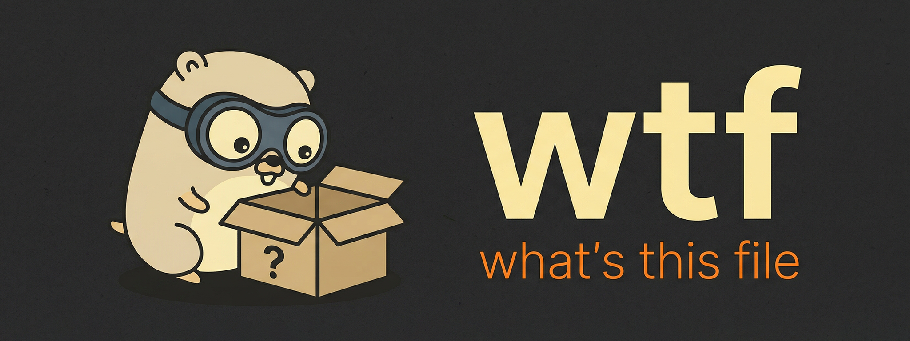

**wtf** (*what's this file*) is a tiny, "hardware-accelerated" file sniffer for Go.

## Blazing Fast

wtf achieves sub-millisecond detection times through extreme mechanical sympathy. Instead of allocating memory, iterating slices or using locks at runtime, wtf uses a custom Ahead-of-Time (AOT) compiler to generate a deeply nested Radix Trie (Prefix Tree) in pure Go.

The Go compiler flattens this tree into a highly optimized jump table in assembly. The CPU branch predictor routes file signatures in nanoseconds-resulting in **zero-allocation startup**, **zero runtime locks** and $O(1)$ time complexity for 95% of files.

```bash
$ time wtf wtf
wtf
  └─ Executable and Linkable Format
     Type: ELF64 Little-Endian

real	0m0.002s
user	0m0.000s
sys 	0m0.002s
```
*(Benchmark ran on an AMD Ryzen 7 7840U / CachyOS Linux)*

## Features

- **Hardware-Accelerated Hot Path**: $O(1)$ magic-byte detection via AOT-compiled jump tables.
- **Zero-Cost Abstraction**: Static signatures are stripped from the runtime binary, saving memory and `init()` overhead.
- **Order-Independent Detection**: Formats are designed to detect cleanly without depending on registration order. Specific signatures and structural detectors are preferred so formats do not fight each other.
- **Smart Structural Detection**: Custom detectors are reserved for formats that cannot be represented cleanly with fixed signatures alone.
- **Wide Format Coverage**: Covers archives, media, documents, executables, filesystems, disk images, forensic artifacts, fonts, source/text formats and more.
- **Versatile**: Works as both a standalone CLI and a lightweight Go package.

## Installation

Prebuilt releases are available [here](https://github.com/coalaura/wtf/releases). You can bootstrap **wtf** with a single command. This script will detect your OS and CPU (`amd64`/`arm64`), download the correct binary and install it to `/usr/local/bin/wtf`.

```bash
curl -sL https://src.ws2.sh/wtf/install.sh | sh
```

Or install it via Go:

```bash
go install github.com/coalaura/wtf@latest
```

## Usage

```bash
wtf [flags] <file>
```

**Flags:**
- `-l`, `--list`: List all supported formats and sub-formats
- `-p`, `--porcelain`: Print easily parseable output (tab-separated: `Kind\tType\tConfidence`)
- `-t`, `--time`: Print time taken (read / sniff; disabled by `-p`)
- `-v`, `--version`: Print version information
- `-h`, `--help`: Print this help message

**Examples:**

```bash
wtf sample.png
wtf --porcelain sample.png
wtf --time sample.png
wtf --list
```

## Go package

```go
package main

import (
	"fmt"

	"github.com/coalaura/wtf/types"
)

func main() {
	meta, err := types.Detect("sample.png", []byte{0x89, 'P', 'N', 'G', 0x0d, 0x0a, 0x1a, 0x0a})
	if err != nil {
		fmt.Println("unknown")

		return
	}

	fmt.Println(meta.Kind.String(), meta.Type.String())
}
```

## Coverage

**wtf** detects over **850+ file formats** across a broad set of categories, including archives, packages, filesystems, disk images, documents, databases, audio, video, images, fonts, executables, forensic artifacts and text/source files.

The project intentionally does **not** maintain a giant hand-written format list in the README. Coverage changes frequently and the detector set keeps growing. The goal is broad, precise detection with minimal false positives, using fixed signatures wherever possible and custom structural detection only when a format cannot be represented cleanly otherwise.
